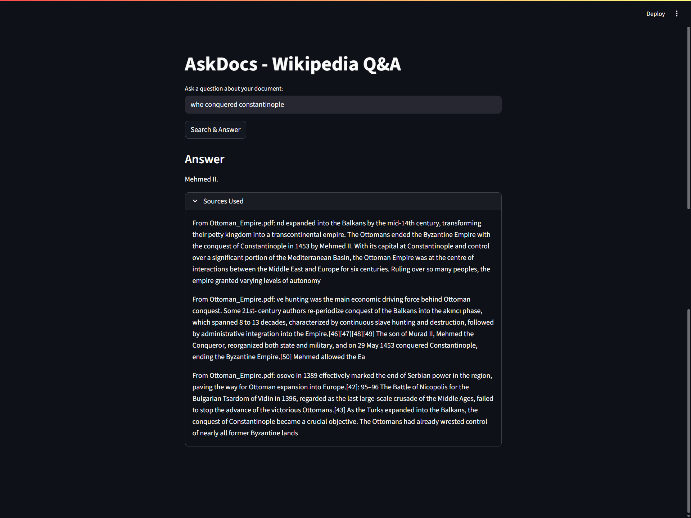

# DeepAge – Local PDF Search & AI Q&A

DeepAge is a Retrieval-Augmented Generation (RAG) system that enables semantic search over your PDFs and context-aware answers using a local embedding model and Groq LLM.

## Features
- Index and search multiple PDF documents.
- Chunking and embedding using Sentence Transformers.
- Vector similarity search via FAISS.
- Answer questions using context-aware LLM (Groq).
- Fully deployable on Streamlit Cloud.

## How It Works

1. **PDF Upload & Text Extraction:** You provide PDFs which are converted to raw text.  
2. **Chunking:** Large text is split into smaller chunks to allow precise embeddings.  
3. **Embeddings Generation:** Each chunk is converted into a vector representation using Sentence Transformers.  
4. **Vector Store:** Chunks and their embeddings are stored in FAISS for fast similarity search.  
5. **Query Processing:** When a user asks a question, the system embeds the query and searches FAISS for the most relevant chunks.  
6. **Context-Aware Answering:** Retrieved chunks are fed to the Groq LLM which generates an answer using only that context.  
7. **Result Display:** The answer along with the sources used is displayed on the Streamlit interface.

## Architecture

```mermaid
flowchart LR
    A[PDF Upload] --> B[Text Extraction]
    B --> C[Chunking]
    C --> D[Embeddings Generation]
    D --> E[FAISS Vector Store]
    F[User Query] --> G[Retrieve Relevant Chunks]
    G --> H[Groq LLM Question Answering]
    E --> G
    H --> I[Answer Displayed to User]
````

## Screenshots

Here are some snapshots of **DeepAge** in action:



## Tech Stack

* **Frontend:** Streamlit
* **Backend:** Python
* **Embeddings:** Sentence Transformers (`all-MiniLM-L6-v2`)
* **Vector Database:** FAISS
* **LLM:** Groq LLM
* **Deployment:** Streamlit Cloud or local

## Installation

```bash
git clone https://github.com/YOUR-USERNAME/deepage.git
cd deepage
python -m venv venv
source venv/bin/activate  # Windows: venv\Scripts\activate
pip install -r requirements.txt
```

## Running Locally

```bash
streamlit run app.py
```

## Environment Variables

Create a `.env` file with:

```
GROQ_API_KEY=your_groq_api_key_here
```

or set it via Streamlit Secrets if deploying to cloud.

## Usage

1. Place PDFs in `data/` folder.
2. Run the ingestion script to generate embeddings:

```bash
python ingest.py
```

3. Open `app.py` with Streamlit and ask questions about your documents.

## License

MIT License.
